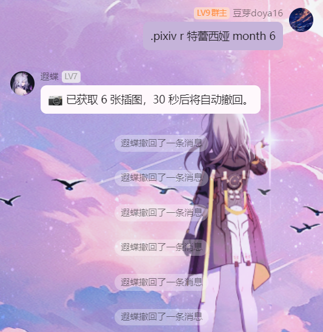
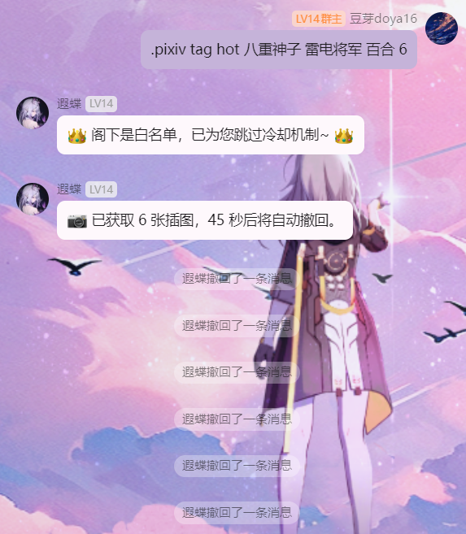
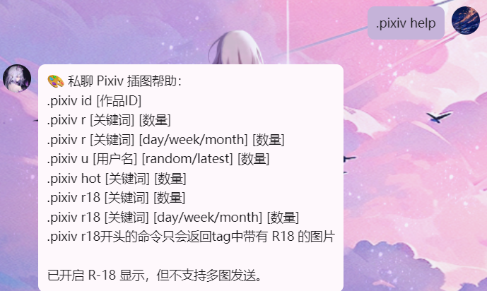
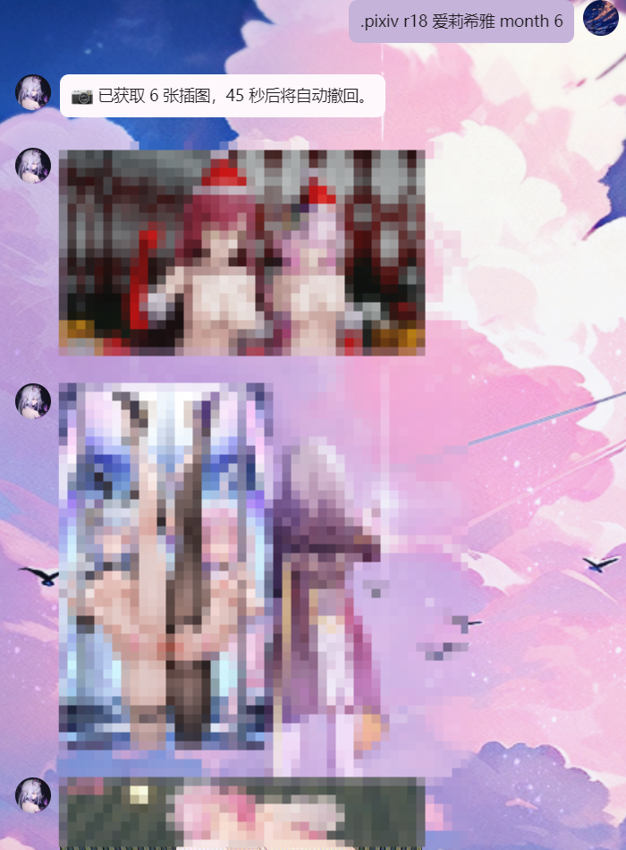

<!-- README language switch -->
[](README.md) [](README.en.md)
<!-- /README language switch -->

# 🎨 Nonebot-Napcat-pixivAPI Plugin

A Pixiv illustration plugin based on [NoneBot2](https://v2.nonebot.dev/) and [Napcat](https://github.com/NapNeko/NapCatQQ).
Retrieve Pixiv illustrations in QQ group and private chats, including rankings, keyword searches, user works, illustration ID lookups, and R-18 content.

---

# 📸 Screenshots

Examples in group and private chats:

### 📍 Group chat



### 📍 Group chat tag search



### 📍 Private chat



### 🔞 Private chat R-18 request



---

# 🧩 1. Features

- Multi-keyword tag searches with `.pixiv tag`, including ranking filters.
- Pixiv daily, weekly, and monthly rankings.
- Keyword searches across regular and popular illustration pools.
- Works from a specified user in `latest` or `random` mode.
- Illustration lookup by ID.
- R-18 illustrations in private chat, including detection of R-18 tags.
- Local image caching and transfer through Napcat's temporary directory.
- Automatic filtering of sensitive content such as violence, gore, tentacles, and guro through `is_sensitive`.
- Automatic message recall: 60 seconds by default in groups and 30 seconds in private chat.
- A configurable cooldown, 60 seconds by default.
- A whitelist that exempts selected users from the cooldown.
- Automatic `access_token` refresh every 25 minutes.
- Persistent local token caching in `pixiv_token.json`.

---

# 🧭 2. Group chat vs. private chat

| Feature | Group plugin `pixiv_plugin.py` | Private plugin `pixiv_plugin_private.py` |
| --- | --- | --- |
| Illustration retrieval | ✅ `.pixiv r/u/id/hot` | ✅ All supported |
| R-18 illustrations | ❌ Not supported | ✅ `.pixiv r18` |
| Sensitive content filtering | ✅ Enabled | ✅ Enabled, with R-18 commands allowed |
| Automatic recall | ✅ 60 seconds by default | ✅ 30 seconds by default |
| Cooldown | ✅ 60 seconds per user | ✅ 60 seconds per user |
| Multiple images | ✅ Up to 6 | ✅ Up to 6 |
| Tag search | ✅ Up to 6 images | ❌ Not supported |

---

# ⚙️ 3. Installation

```bash
git clone https://github.com/Doya16/Nonebot-Napcat-pixivAPI.git
pip install -r requirements.txt
# Or install manually
pip install pixivpy3 httpx
```

- Group chat plugin: `plugins/pixiv_plugin.py`
- Private chat plugin: `plugins/pixiv_plugin_private.py`

Make sure Napcat is running and configure its temporary image directory, `NAPCAT_TEMP_DIR`, correctly.

---

# 🔐 4. Obtain Pixiv tokens

1. Run the authorization script; refer to the pixivpy3 documentation:

```bash
python pixiv_auth.py login
```

2. After logging into Pixiv, find `code=XXXXXX` in the browser developer tools and copy it.
3. Paste it into the terminal to obtain `refresh_token` and `access_token`.

---

# 📁 5. Token configuration

Recommended: use a `.env` file.

```env
PIXIV_REFRESH_TOKEN=YOUR_REFRESH_TOKEN
```

The plugin uses `refresh_token` to obtain `access_token` automatically and saves it to:

```text
plugins/cache/pixiv_token.json
```

Both the group and private chat plugins read this file automatically.

---

# 🔧 6. Variables to configure

Before using the plugin, adjust these variables for your environment.

| Variable | Location | Example / default | Description |
| --- | --- | --- | --- |
| `REFRESH_TOKEN` | `pixiv_plugin.py` | `"r4lOlQ3hTi0X-..."` | Pixiv refresh token for API authentication |
| `COOLDOWN_SECONDS` | Group + private plugins | `45` or `60` | Command cooldown in seconds |
| `RECALL_SECONDS` | Group + private plugins | `45` or `60` | Delay before recalling sent illustrations |
| `NAPCAT_TEMP_DIR` | Group + private plugins | `r"D:\QQFiles\NapCat\temp"` | Napcat temporary image directory; use your actual path |
| `CACHE_DIR` | Group + private plugins | `plugins/cache/pixiv_download/` | Illustration cache, created automatically |
| `TOKEN_PATH` | Group + private plugins | `plugins/cache/pixiv_token.json` | Access token cache, generated automatically |
| `ADMIN_QQ` | `pixiv_plugin.py` | `1234567890` | Administrator QQ number allowed to use `.pixiv refresh` |
| `WHITELIST_USERS` | `pixiv_plugin.py` | `{"1234567890"}` | Set of QQ numbers exempt from the cooldown |

💡 Store `REFRESH_TOKEN` in `.env` for centralized management, for example:

```env
PIXIV_REFRESH_TOKEN=YOUR_TOKEN_STRING
```

The plugin also includes its own token management logic if you do not use this approach.

---

Missing directories are created automatically. On the first run, the plugin also refreshes the token and writes `pixiv_token.json`.

# 💬 7. Command reference

Replace bracketed placeholders with your values; command keywords such as `tag`, `r`, `hot`, and `r18` remain unchanged.

## 🧠 Multi-keyword tag search (new; group chat only)

| Command | Description |
| --- | --- |
| `.pixiv tag hot [keyword1] [keyword2] ... [count]` | Popular illustrations matching multiple tags |
| `.pixiv tag r [keyword1] [keyword2] ... [count]` | Random illustrations matching multiple tags, sorted by latest |
| `.pixiv tag r [keywords...] [week/month/day] [count]` | Combine multiple tags with ranking filters |

## 📥 Illustration retrieval (group + private chat)

| Command | Description |
| --- | --- |
| `.pixiv r` | Retrieve illustrations from the Pixiv daily ranking |
| `.pixiv r [keyword] [count]` | Search illustrations; defaults to latest |
| `.pixiv r [keyword] [day/week/month] [count]` | Search ranking illustrations |
| `.pixiv r [day/week/month] [count]` | Retrieve random illustrations from a ranking |

## 🔥 Popular illustrations

| Command | Description |
| --- | --- |
| `.pixiv hot [keyword] [count]` | Retrieve popular illustrations |

## 👤 User works

| Command | Description |
| --- | --- |
| `.pixiv u [username]` | Retrieve the user's latest illustrations |
| `.pixiv u [username] random/latest [count]` | Specify the mode and number of images |

## 🆔 Illustration IDs

| Command | Description |
| --- | --- |
| `.pixiv id [illustration ID]` | Retrieve an illustration by its Pixiv ID |

## 🔞 Private chat only

| Command | Description |
| --- | --- |
| `.pixiv r18 [keyword] [count]` | Retrieve R-18 illustrations |
| `.pixiv r18 [keyword] [day/week/month] [count]` | Retrieve R-18 illustrations from rankings |

---

# 📂 8. Paths

| Item | Default path |
| --- | --- |
| Illustration cache | `plugins/cache/pixiv_download/` |
| Access token storage | `plugins/cache/pixiv_token.json` |
| Temporary images | `NAPCAT_TEMP_DIR`; set this to Napcat's temporary directory |

---

# ⏱️ 9. Cooldown and recall

- Per-user request cooldown: **60 seconds**; change `COOLDOWN_SECONDS` to adjust it.
- Automatic recall after sending: **60 seconds in groups / 30 seconds in private chat**.
- Whitelisted users can bypass the cooldown; configure them in `WHITELIST_USERS`.

---

# 🪪 10. License

MIT License

---

# 🙏 11. Acknowledgments

- [NoneBot2](https://github.com/nonebot/nonebot2)
- [PixivPy](https://github.com/upbit/pixivpy)
- [Napcat](https://github.com/NapNeko/NapCatQQ)
- [httpx](https://www.python-httpx.org/)

Developed and maintained by [@Doya16](https://github.com/Doya16).
