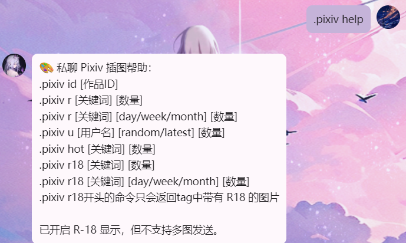

# 🎨 Nonebot-Napcat-pixivAPI 插件

基于 [NoneBot2](https://v2.nonebot.dev/) 和 [Napcat](https://github.com/NapNeko/NapCatQQ) 的 Pixiv 插图获取插件。
支持 QQ 群聊 / 私聊中获取 Pixiv 插图，支持热榜、关键词搜索、用户作品、ID 查询、R-18 内容等。

---

# 📸 演示截图

以下为插件在群聊、私聊中的使用演示截图：

### 📍 群聊效果


### 📍 群聊标签效果


### 📍 私聊效果



### 🔞 私聊 R-18 效果


---

# 🧩 一、功能特性

- 支持多关键词 tag 搜索 `.pixiv tag`（含排行榜筛选）
- 支持 Pixiv 排行榜（日 / 周 / 月）插图获取
- 支持关键词插图搜索（含普通与热门图池）
- 支持指定用户作品（latest / random 模式）
- 支持通过 ID 查询插图
- 私聊支持获取 R-18 插图（并检测 tag 中是否包含 R-18 标签）
- 插图缓存至本地并经 Napcat 临时路径中转
- 自动过滤暴力、血腥、触手、Guro 等敏感内容（通过 `is_sensitive` 函数）
- 群聊支持自动撤回（默认 60 秒），私聊 30 秒
- 全局冷却时间限制（默认 60 秒）
- 支持白名单机制，白名单用户不受冷却限制
- access_token 自动刷新，每 25 分钟刷新一次
- 插件支持 token 本地持久化缓存至 `pixiv_token.json`

---

# 🧭 二、群聊版 vs 私聊版

| 功能           | 群聊版本 `pixiv_plugin.py` | 私聊版本 `pixiv_plugin_private.py` |
|----------------|-----------------------------|-------------------------------------|
| 插图获取       | ✅ 支持 `.pixiv r/u/id/hot` | ✅ 全支持                           |
| R-18 插图      | ❌ 不支持                   | ✅ 支持 `.pixiv r18` 指令           |
| 敏感过滤       | ✅ 启用                     | ✅ 启用但允许 R-18 指令              |
| 自动撤回       | ✅ 默认 60 秒               | ✅ 默认 30 秒                        |
| 冷却限制       | ✅ 每用户 60 秒             | ✅ 每用户 60 秒                      |
| 多图支持       | ✅ 最多 6 张                 | ✅ 最多 6 张                         |
| tag搜索        | ✅ 最多 6 张                 | ❌ 不支持                            |

---

# ⚙️ 三、安装方式

```bash
git clone https://github.com/Doya16/Nonebot-Napcat-pixivAPI.git
pip install -r requirements.txt
# 或手动安装
pip install pixivpy3 httpx
```

- 群聊版插件：`plugins/pixiv_plugin.py`
- 私聊版插件：`plugins/pixiv_plugin_private.py`

确保 Napcat 正常运行，并正确配置其临时图片目录 `NAPCAT_TEMP_DIR`。

---

# 🔐 四、Pixiv Token 获取

1. 运行授权脚本（参考 pixivpy3 文档）：
```bash
python pixiv_auth.py login
```

2. 登录 Pixiv 后，在浏览器开发者工具中找到 `code=XXXXXX`，复制

3. 粘贴回终端，获取 `refresh_token` 和 `access_token`

---

# 📁 五、Token 配置

推荐方式：`.env` 文件

```env
PIXIV_REFRESH_TOKEN=你的refresh_token
```

插件将使用 `refresh_token` 自动获取 `access_token` 并保存到：

```
plugins/cache/pixiv_token.json
```

群聊与私聊插件将自动读取该文件。

---

# 💬 六、全部命令一览

## 🧠 多关键词 tag 搜索（新功能，仅群聊）

| 命令 | 说明 |
|------|------|
| `.pixiv tag hot [关键词1] [关键词2] ... [数量]` | 获取多个 tag 的热门插图 |
| `.pixiv tag r [关键词1] [关键词2] ... [数量]` | 获取多个 tag 的随机插图（最新排序） |
| `.pixiv tag r [关键词...] [week/month/day] [数量]` | 多 tag + 榜单模式混合筛选 |


## 📥 插图获取（群聊 + 私聊）

| 命令 | 说明 |
|------|------|
| `.pixiv r` | 获取 Pixiv 日榜图 |
| `.pixiv r [关键词] [数量]` | 搜索插图（默认 latest） |
| `.pixiv r [关键词] [day/week/month] [数量]` | 搜索榜图 |
| `.pixiv r [day/week/month] [数量]` | 获取榜单随机图 |

## 🔥 热门插图

| 命令 | 说明 |
|------|------|
| `.pixiv hot [关键词] [数量]` | 获取热门插图 |

## 👤 用户插图

| 命令 | 说明 |
|------|------|
| `.pixiv u [用户名]` | 获取该用户最新插图 |
| `.pixiv u [用户名] random/latest [数量]` | 指定模式 + 数量 |

## 🆔 插图ID

| 命令 | 说明 |
|------|------|
| `.pixiv id [作品ID]` | 通过 Pixiv 作品 ID 获取插图 |

## 🔞 私聊专属

| 命令 | 说明 |
|------|------|
| `.pixiv r18 [关键词] [数量]` | 获取 R-18 插图 |
| `.pixiv r18 [关键词] [day/week/month] [数量]` | 获取榜单中 R-18 插图 |

---

# 📂 七、路径说明

| 项目 | 默认路径 |
|------|-----------|
| 插图缓存 | `plugins/cache/pixiv_download/` |
| access_token 保存 | `plugins/cache/pixiv_token.json` |
| 临时图片路径 | `NAPCAT_TEMP_DIR`（请手动配置为 Napcat temp 目录） |

---

# ⏱️ 八、冷却与撤回说明

- 每位用户请求冷却时间：`60秒`（可修改 `COOLDOWN_SECONDS`）
- 插图发送后自动撤回时间：`群聊 60 秒 / 私聊 30 秒`
- 支持白名单用户跳过冷却（配置在 `WHITELIST_USERS` 中）

---

# 🪪 九、开源协议

MIT License

---

# 🙏 十、致谢

- [NoneBot2](https://github.com/nonebot/nonebot2)
- [PixivPy](https://github.com/upbit/pixivpy)
- [Napcat](https://github.com/NapNeko/NapCatQQ)
- [httpx](https://www.python-httpx.org/)

插件由 [@Doya16](https://github.com/Doya16) 开发维护
